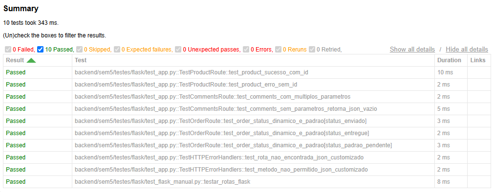

## Usando UV para instalar Flask em um ambiente venv

    uv venv .venv

        Using CPython 3.12.13
        Creating virtual environment at: .venv
        Activate with: .venv\Scripts\activate

    uv init
        Initialized project `codigos`

    source .venv/Scripts/activate
        (.venv) 

### Instalando o Flask

    uv add flask

        Resolved 8 packages in 376ms
            Built codigos @ file://
        Prepared 5 packages in 295ms
        Installed 8 packages in 151ms
        + blinker==1.9.0
        + click==8.5.0
        + codigos==0.1.0 (from file:///)
        + flask==3.1.3
        + itsdangerous==2.2.0
        + jinja2==3.1.6
        + markupsafe==3.0.3
        + werkzeug==3.1.8

### Carregando o app do Flask

    uv run app.py

    
        uv add pyngrok

        Resolved 10 packages in 923ms
            Built codigos @ file:/
        Prepared 2 packages in 152ms
        Uninstalled 1 package in 9ms
        Installed 3 packages in 148ms
        ~ codigos==0.1.0 (from file://)
        + pyngrok==8.1.2
        + pyyaml==6.0.3

### Semana 3 - uso de CORS (sem3)

    uv add flask_cors

    Resolved 11 packages in 333ms
      Built codigos @ file://         
    Prepared 2 packages in 96ms
    Uninstalled 1 package in 17ms
    Installed 2 packages in 53ms
    ~ codigos==0.1.0 (from file://)
    + flask-cors==6.0.5

## Webconferência

        uv add gunicorn

Resolved 12 packages in 316ms
      Built codigos @ file://
Prepared 2 packages in 335ms
Uninstalled 1 package in 15ms
Installed 2 packages in 97ms
 ~ codigos==0.1.0 (from file://)
 + gunicorn==26.2.0
(.venv) 

### Waitress (compatibilidade Windows)

        uv add waitress

Resolved 13 packages in 179ms
      Built codigos @ file://
Prepared 2 packages in 76ms
Uninstalled 1 package in 6ms
Installed 2 packages in 37ms
 ~ codigos==0.1.0 (from file://)
 + waitress==3.0.2

## Instalando pytest sem5

        uv add pytest

Resolved 19 packages in 417ms
      Built codigos @ file://        
Prepared 1 package in 92ms
Uninstalled 1 package in 5ms
Installed 7 packages in 1.19s
 ~ codigos==0.1.0 (from file:/)
 + colorama==0.4.6
 + iniconfig==2.3.0
 + packaging==26.3
 + pluggy==1.6.0
 + pygments==2.21.0
 + pytest==9.1.1

### Exibir os Testes no Terminal
Você pode usar flags do pytest para mudar o formato de exibição dos seus testes:
Exibição Detalhada (Nome por Nome), adicione a flag -v (verbose):

        python -m pytest -v

Exibição Detalhada + Saída do print(), por padrão, o pytest esconde as chamadas de print(). Adicione a flag -s para exibi-las no terminal:

        python -m pytest -v -s

## Instalando pytest html - Gerar um Relatório Visual (HTML)

        uv add pytest-html

Resolved 21 packages in 368ms
      Built codigos @ file://        
Prepared 3 packages in 138ms
Uninstalled 1 package in 5ms
Installed 3 packages in 69ms
 ~ codigos==0.1.0 (from file://)
 + pytest-html==4.2.0
 + pytest-metadata==3.1.1

Execute o pytest indicando onde salvar o relatório:

        python -m pytest --html=relatorio_testes.html

Resposta:

        ========================================================= test session starts ==========================================================
        platform win32 -- Python 3.12.14, pytest-9.1.1, pluggy-1.6.0
        rootdir: C:\
        configfile: pyproject.toml
        plugins: html-4.2.0, metadata-3.1.1
        collected 10 items                                                                                                                      

        test_app.py .........                                                                                                             [ 90%]
        test_flask_manual.py .                                                                                                            [100%]

        - Generated html report: file:///relatorio_testes.html -

